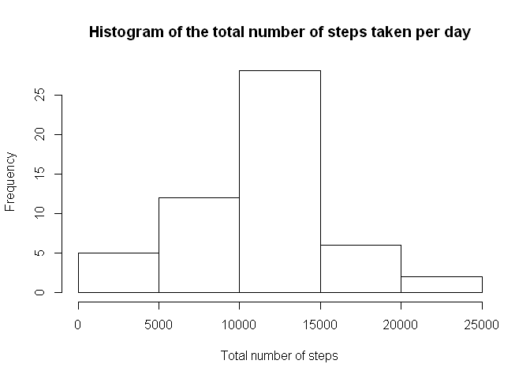
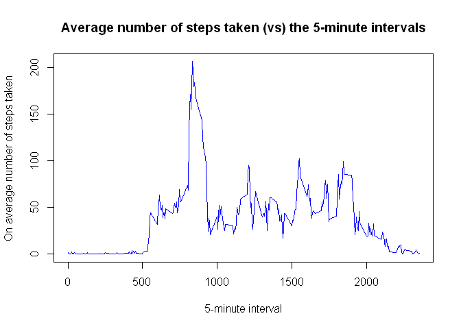
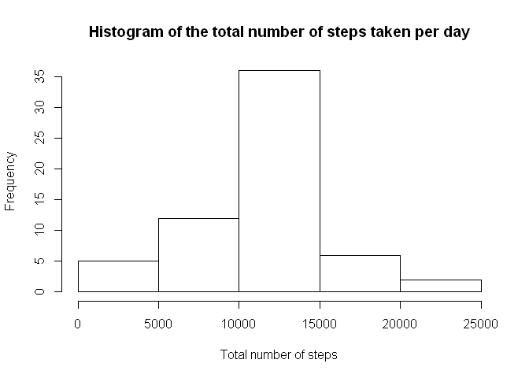
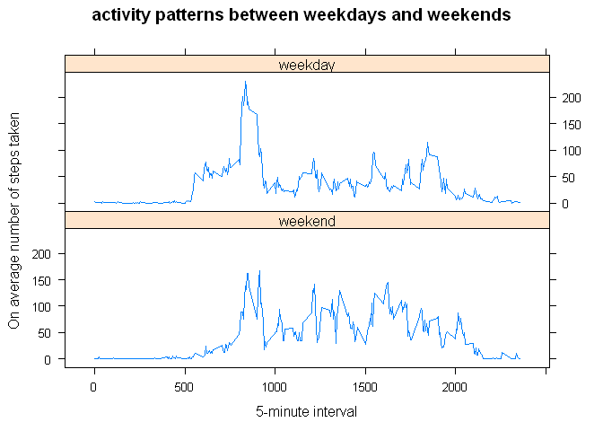

# Reproducible Research: Peer Assessment 1


## Loading and preprocessing the data

Loading the data ... 

```r
library(sqldf)
```

```
## Warning: package 'sqldf' was built under R version 3.2.2
```

```
## Loading required package: gsubfn
```

```
## Warning: package 'gsubfn' was built under R version 3.2.2
```

```
## Loading required package: proto
```

```
## Warning: package 'proto' was built under R version 3.2.2
```

```
## Loading required package: RSQLite
```

```
## Warning: package 'RSQLite' was built under R version 3.2.2
```

```
## Loading required package: DBI
```

```
## Warning: package 'DBI' was built under R version 3.2.2
```

```r
library(lattice)
library(dplyr)
```

```
## Warning: package 'dplyr' was built under R version 3.2.2
```

```
## 
## Attaching package: 'dplyr'
## 
## The following objects are masked from 'package:stats':
## 
##     filter, lag
## 
## The following objects are masked from 'package:base':
## 
##     intersect, setdiff, setequal, union
```

```r
activityData <- read.csv("./activity.csv")
```

Process/transform the data into a format suitable for the analysis ...


```r
activityData$date <- as.Date(activityData$date)
```


## What is mean total number of steps taken per day?

Calculating the total number of steps taken per day ...


```r
dat <- sqldf("select sum(activityData.steps) as TotalSteps, date from activityData group by date")
```

```
## Loading required package: tcltk
```

```r
dat$TotalSteps <- as.numeric(dat$TotalSteps)
```

Making a histogram of the total number of steps taken each day ...


```r
## histogram of the total number of steps taken each day
hist(dat$TotalSteps, breaks=6, xlab ="Total number of steps", main = "Histogram of the total number of steps taken per day")
```

 

Calculating the mean and median of the total number of steps taken per day ... 


```r
## mean of the total number of steps taken per day
meanStepsBefore <- mean(dat$TotalSteps, na.rm=T)  
```

Mean of the total number of steps taken per day is **10766.19**


```r
## median of the total number of steps taken per day
medianStepsBefore <- median(dat$TotalSteps, na.rm=T) 
```

Median of the total number of steps taken per day is **10765.00**
`

## What is the average daily activity pattern?


```r
dat2 <- sqldf('select AVG(activityData.steps) as avgSteps, interval from activityData group by interval')
```

Time series plot of the 5-minute interval (x-axis) and the average number of steps taken, averaged across all days (y-axis) ...


```r
with(dat2, plot(avgSteps ~ interval , col = "blue", type = 'l', xlab = " 5-minute interval ", ylab = " On average number of steps taken ", main = "Average number of steps taken (vs) the 5-minute intervals"))
```

 


```r
maxsteps <- sqldf('select max(avgSteps), interval from dat2')
```

The 5-minute interval containing the maximum number of steps is **835**


## Imputing missing values


```r
## Total number of missing values in the dataset
nacount <- sum(is.na(activityData$steps))
```

The total number of missing values in the dataset (i.e. the total number of rows with NA s) : **2304**

#### Strategy for filling in all of the missing values:
All of the missing values in the dataset are filled with the mean for that 5-minute interval.


```r
naDat <- activityData[which(is.na(activityData$steps) == T),]  ## 2304
newDat1 <- sqldf('select dat2.avgSteps , naDat.date, naDat.interval from dat2, naDat where dat2.interval == naDat.interval')
colnames(newDat1) <- c("steps", "date", "interval")
```

Creating a new dataset that is equal to the original dataset but with the missing data filled in ...


```r
gooddat <- activityData[which(is.na(activityData$steps) == F),] 
gooddat$steps <- as.numeric(gooddat$steps)

newDat <- union(gooddat, newDat1)
newDat <- sqldf('select * from newDat order by date, interval')
```

Make a histogram of the total number of steps taken each day


```r
newhist <- sqldf("select sum(newDat.steps) as TotalSteps, date from newDat group by date")
hist(newhist$TotalSteps, breaks = 6, xlab ="Total number of steps", main = "Histogram of the total number of steps taken per day")
```

 

Calculating mean and median total number of steps taken per day ...


```r
## mean of the total number of steps taken per day -- new data
meanStepsAfter <- mean(newhist$TotalSteps, na.rm=T)  

## median of the total number of steps taken per day -- new data
medianStepsAfter <- median(newhist$TotalSteps, na.rm=T)   
```

Mean of the total number of steps taken per day before **10766.19** and after **10766.19**

Median of the total number of steps taken per day before **10765.00** and after **10766.19**

## Are there differences in activity patterns between weekdays and weekends?

Creating a new factor variable (dayfactor) in the dataset with two levels - "weekday" and "weekend" indicating whether a given date is a weekday or weekend day ...


```r
weekdayslist <- c('Monday', 'Tuesday', 'Wednesday', 'Thursday', 'Friday')

newDat$dayfactor <- factor((weekdays(newDat$date) %in% weekdayslist), 
                           levels = c(F,T), labels=c('weekend','weekday'))
```

Making a panel plot containing a time series plot of the 5-minute interval (x-axis) and the average number of steps taken, averaged across all weekday days or weekend days (y-axis) ...


```r
avgweekday <- sqldf('select AVG(newDat.steps) as avgSteps, interval, dayfactor from newDat group by interval,dayfactor')
with(avgweekday, xyplot(avgSteps ~ interval | dayfactor , data = avgweekday, type="l",layout = c(1,2),xlab = " 5-minute interval ", ylab = " On average number of steps taken ", main = "activity patterns between weekdays and weekends"))
```

 
